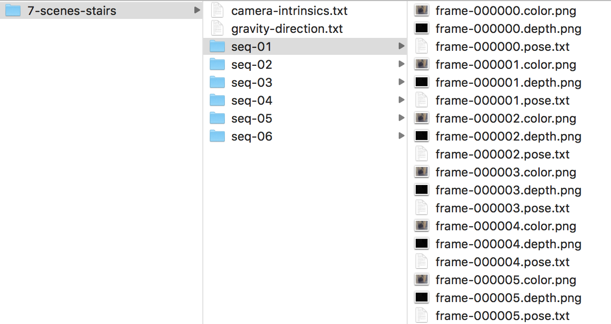
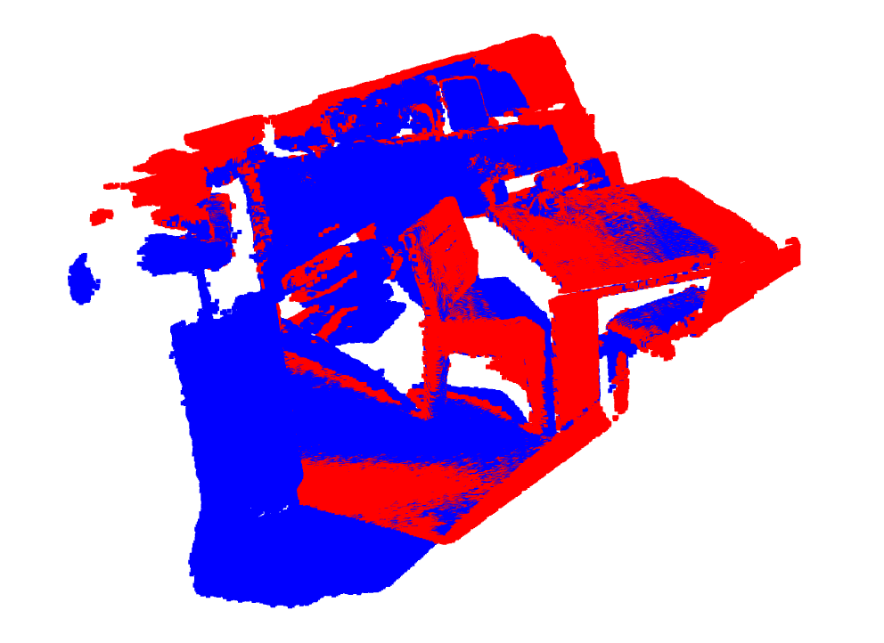

## 关于

- train.txt: 训练集的场景名(54)
- test.txt: 测试集的场景名(8)
- fuse_fragments_3DMatch.py: 如何由多帧深度图融合得到点云数据(ply)
- trainset_fcgf.py: 3DMatch训练集(FCGF)的统计分析代码
- trainset_d3feat.py: 3DMatch训练集(D3Feat)的统计分析代码
- test_set.py: 测试集的统计分析代码
- images: 可视化截图

## 一、3DMatch数据集简介

3DMatch数据集收集了来自于62个场景的数据，其中54个场景的数据用于训练，8个场景的数据用于评估，其具体名称查看`train.txt`和`test.txt`。3DMatch数据常用于3D点云的关键点，特征描述子，点云配准等任务。

[官方主页](https://3dmatch.cs.princeton.edu/) | [3DMatch: Learning Local Geometric Descriptors from RGB-D Reconstructions](https://openaccess.thecvf.com/content_cvpr_2017/papers/Zeng_3DMatch_Learning_Local_CVPR_2017_paper.pdf) [CVPR 2017]

3DMatch原始数据集: [下载地址](http://3dmatch.cs.princeton.edu/#rgbd-reconstruction-datasets)，共包括64个.zip文件。

以其中一个场景`7-scenes-stairs`为例，介绍其数据格式，如下截图所示，原始的3DMatch数据集包括两个`.txt`文件，多个`seq`文件夹，每个`seq`文件夹下包括多帧的`.color.png`, `.depth.png`, `.pose.txt`，可以看到，
其本身是不包括点云数据的，但是可以由这些数据生成点云数据(ply)，一般是50帧-100帧生成一个点云数据，生成点云的代码可以参考`fuse_fragments_3DMatch.py`。



下面介绍3DMatch的训练集，包括[FCGF](https://github.com/chrischoy/FCGF)和[D3Feat](https://github.com/XuyangBai/D3Feat)处理的训练集。

## 二、3DMatch的训练集(FCGF)

3DMatch训练集来自54个场景，详细类别名称参见`train.txt`。每个场景均由1个seq或者多个seq的数据组成。这里以[FCGF](https://github.com/chrischoy/FCGF)
网络使用的数据格式为例介绍3DMatch数据集。

首先，从[这里](http://node2.chrischoy.org/data/datasets/registration/threedmatch.tgz)下载训练集，下载解压后可以得到401个`txt`文件和2189个`npz`文件。2189个`npz`对应每个点云数据，包括(x, y, z)及对应的(r, g, b)信息，其中命名规则是`场景@seqid-id`，例如7-scenes-chess@seq-01_000.npz，表示此数据来自7-scenes-chess场景的seq-01，编号为000。401个txt表示这些npz的点云数据是如何关联的，其命名规则为`场景@seqid-overlap`，如7-scenes-chess@seq-01-0.30.txt表示7-scenes-chess场景的seq-01下的overlap大于0.30的数据，打开此文件后，可以看到如下信息:

```text
7-scenes-chess@seq-01_000.npz 7-scenes-chess@seq-01_001.npz 0.886878
7-scenes-chess@seq-01_000.npz 7-scenes-chess@seq-01_002.npz 0.636459
7-scenes-chess@seq-01_000.npz 7-scenes-chess@seq-01_003.npz 0.825012
7-scenes-chess@seq-01_000.npz 7-scenes-chess@seq-01_004.npz 0.783642
```

每一行表示点云之间的对应关系，如第一行表示点云7-scenes-chess@seq-01_000.npz和7-scenes-chess@seq-01_001.npz具有0.886878的overlap。可视化结果如下，第一个图中的红色的点云是7-scenes-chess@seq-01_000.npz，蓝色的点云是7-scenes-chess@seq-01_001.npz，可以看到两者是对齐的；第二个图是这两个点云的rgb信息的可视化。


统计了一下，54个场景总共提供了**7960**对点云。

**上述的统计信息的相关代码在`trainset_fcgf.py`**

## 三、3DMatch训练集(D3Feat)

下载D3Feat训练使用的[3DMatch数据集](https://drive.google.com/file/d/1Vo-D_NOs4HS9wwAE-55ggDpgaPfzdRRt/view?usp=sharing)，解压后是6个`.pkl`文件，分别是
`3DMatch_train_0.030_keypts.pkl`, `3DMatch_train_0.030_overlap.pkl`, `3DMatch_train_0.030_points.pkl`, `3DMatch_val_0.030_keypts.pkl`, `3DMatch_val_0.030_overlap.pkl`和
`3DMatch_val_0.030_points.pkl`，可以通过[这里](https://github.com/XuyangBai/D3Feat/blob/master/datasets/cal_overlap.py)查看这些`.pkl`文件是如何产生的。

- `3DMatch_train_0.030_keypts.pkl`存储了什么信息 ?

    点云名(str, 如`sun3d-brown_bm_1-brown_bm_1/seq-01/cloud_bin_0`) -> 点云(ndarray, n x 3)。

    总共有`3933`个点云数据，点云点最少的是`850`个，点云点最多的是`197343`，平均点云点数量是`27127`。
- `3DMatch_train_0.030_overlap.pkl`存储了什么信息 ?

    点云对(str, 如`7-scenes-pumpkin/seq-07/cloud_bin_11@7-scenes-pumpkin/seq-08/cloud_bin_2`) -> overlap值(float)

    总共有`35297`个点云对，overlap的最小值为`0.30`，最大值`0.995`，平均值为`0.515`。
- `3DMatch_train_0.030_points.pkl`存储了什么信息 ?

    点云对(str, 如`analysis-by-synthesis-office2-5b/seq-01/cloud_bin_34@analysis-by-synthesis-office2-5b/seq-01/cloud_bin_35`) -> 映射关系(ndarray, m x 2)
- 可视化pairs中的点云和对应关键点


左图为两个具有overlap的点云的可视化，中间和右边的可视化是分别在红色和绿色点云上添加了对应点(**蓝色区域**)(来自于`3DMatch_train_0.030_points.pkl`)的可视化结果。

上述相关代码在`trainset_d3feat.py`。(为什么D3Feat的训练集中点云和点云对数量比FCGF中的点云和点云对数量多这么多 ?还待验证。)

## 四、3DMatch的测试集

3DMatch的测试集包括以下8个场景，其中每个场景对应两个文件夹。以`7-scenes-redkitchen`为例，它包括7-scenes-redkitchen和7-scenes-redkitchen-evaluation两个文件夹，7-scenes-redkitchen文件夹下存放的是点云数据，命名格式均为`cloud_bin_*.ply`，共包括60个点云数据；7-scenes-redkitchen-evaluation/gt.log存放了correspondences点云对，组织格式为:

```text
0    1   60
 9.96926560e-01   6.68735757e-02     -4.06664421e-02     -1.15576939e-01
-6.61289946e-02   9.97617877e-01      1.94008687e-02     -3.87705398e-02
 4.18675510e-02  -1.66517807e-02      9.98977765e-01      1.14874890e-01
 0.00000000e+00   0.00000000e+00      0.00000000e+00      1.00000000e+00
0    2   60
 9.54999224e-01   1.08859481e-01     -2.75869135e-01     -3.41060560e-01
-9.89491703e-02   9.93843326e-01      4.96360476e-02     -1.78254668e-01
 2.79581388e-01  -2.01060700e-02      9.59896612e-01      3.54627338e-01
 0.00000000e+00   0.00000000e+00      0.00000000e+00      1.00000000e+00
```

`0   1   60`中的0和1表示cloud_bin_0.ply和cloud_bin_1.ply点云是成对的，60表示总共包括有60个点云数据(前面也提到过)，下面四列表示cloud_bin_1.ply -> cloud_bin_0.ply的变换矩阵。

**可视化变换后的点云**，红色的表示cloud_bin_0.ply点云，蓝色的表示对cloud_bin_1.ply变换后的点云，可视化结果显示两者基本重叠:



其它场景的统计数据如下，可视化和统计信息的代码均可通过`test_set.py`实现。

| 名称 | 点云数量 | Pairs数量 |
| :---: | :---: | :---: |
| 7-scenes-redkitchen | 60 | 506 |
| sun3d-home_at-home_at_scan1_2013_jan_1 | 60 | 156 |
| sun3d-home_md-home_md_scan9_2012_sep_30 | 60 | 208 |
| sun3d-hotel_uc-scan3 | 55 | 226 |
| sun3d-hotel_umd-maryland_hotel1 | 57 | 104 |
| sun3d-hotel_umd-maryland_hotel3 | 37 | 54 |
| sun3d-mit_76_studyroom-76-1studyroom2 | 66 | 292 |
| sun3d-mit_lab_hj-lab_hj_tea_nov_2_2012_scan1_erika | 38 | 77 |
| 总计 | 433 | 1623 |

**上述的统计信息的相关代码在`test_set.py`**

## 五、3DMatch数据集的评估指标

评估指标主要基于[FCGF](https://node1.chrischoy.org/data/publications/fcgf/fcgf.pdf) [ICCV 2019]，评估代码请参考[https://github.com/chrischoy/FCGF/blob/master/scripts/benchmark_3dmatch.py](https://github.com/chrischoy/FCGF/blob/master/scripts/benchmark_3dmatch.py)。但Registration Recall的实现我感觉有问题，待日后再做补充吧。

- Feature-match Recall

    $$R = \frac{1}{M} \Sigma_{s=1}^M 1([\frac{1}{|\Omega_s|}\Sigma_{(i, j) \in \Omega_s}1(||T^* \text{x}_i - \text{y}_j|| < \tau_1) ] > \tau_2)$$

    $M$表示pairs点云对的数量，$1$表示指示函数，$\Omega_s$是第$s$个pair的correspondences，$T^*$表当前pair点云的G.T.的R,t变换。$\text{y}_j$是$\text{x}_i$在$Y$中选择的**Feature Distance**最小的点，即$\text{y}_j = \arg \min_{\text{y}_j} ||F_{\text{x}_i} - F_{\text{y}_j}||, \text{y}_j \in Y$。$\tau_1$和$\tau_2$是两个超参数，常取值$\tau_1 = 0.1$，$\tau_2 = 0.05$。

    简单的说，就是有M个点云对，对每一个点云对做一个是特征好/坏的判断: 在真实R,t的情况下，计算$(\text{x}_i, \text{y}_j)$距离小于$\tau_1$的比例r，如果r大于$\tau_2$，则表示这个点云特征好，否则特征是坏的。

- Registration Recall

    $$E_{\text{RMSE}} = \sqrt {\frac{1}{\Omega_*}\Sigma_{(\text{x}^*, \text{y}^*) \in \Omega_*} ||\hat T_{i, j}\text{x}^* - \text{y}^*||^2}$$

    $\Omega_*$表示$(i, j)$点云对中correspondences的数量，$(\text{x}^*, \text{y}^*)$表示G.T.的pair，$\hat T_{i, j}$表示基于$(i, j)$点云对预测的R,t变换。

    对于具有至少30% overlap的点云对，如果$E_\text{RMSE} < 0.2$，则表示这是一个正确的点云对。
